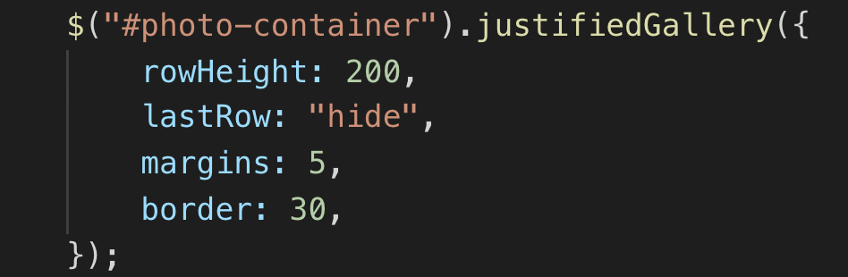

# K.L.M.S. Travel

## Description
We built an app based on traveling. The user has access to dynamically generated weather cards. Also, the user can search new cities and generate a new weather card. Upon clicking on a card, the user will be scrolled down to the pictures and resturants sections where more information is displayed. Our site is a single page with three API calls.

## See it in action:

## Technologies used:
* HTML
* Bootstrap
  * Layout
* jQuery
  * Event handling
  * Dynamically generate new elements
  * Appending new elements to the HTML
  * Added attributes to dynamically generated elements
* AJAX API calls
  * OpenWeatherMap
  * Unsplash
  * Yelp Fusion
* Justified Gallery library
  * Displays photos in a justified grid
* Firebase
  * Storing the value of exisiting generated city cards
* Github
  * Branching
  * Version control

## API code snippets:
 * OpenWeatherMap API
 

  * Unsplash API
 

 * Yelp Fusion API
 

## Library code snippet:

## Firebase code snippet:

## Contributors
 - Links to our Githubs
    - [Leticia](https://github.com/leticiaroncero)
    - [Monica](https://github.com/Mamitin)
    - [Katia](https://github.com/katrinity)
    - [Shelby](https://github.com/shelbyreins)